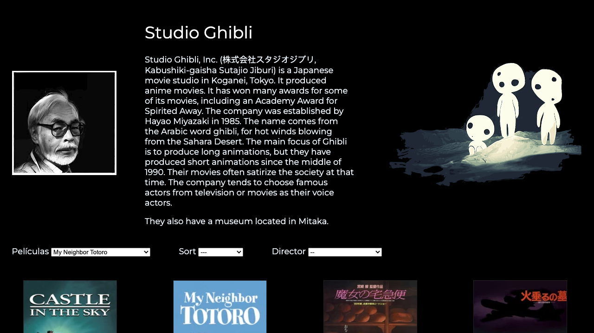
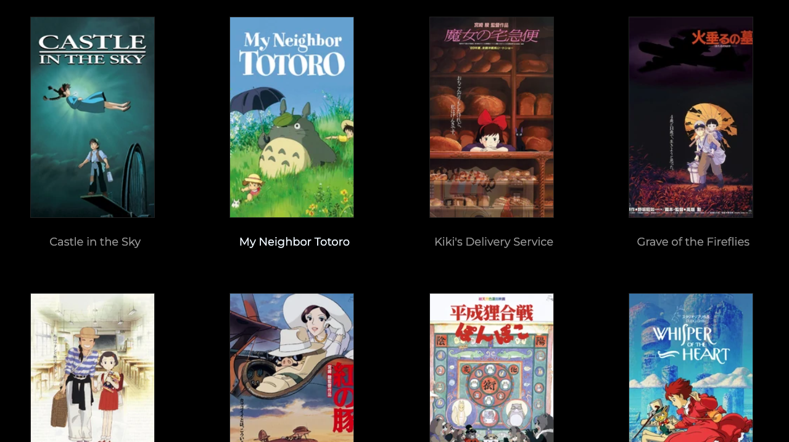
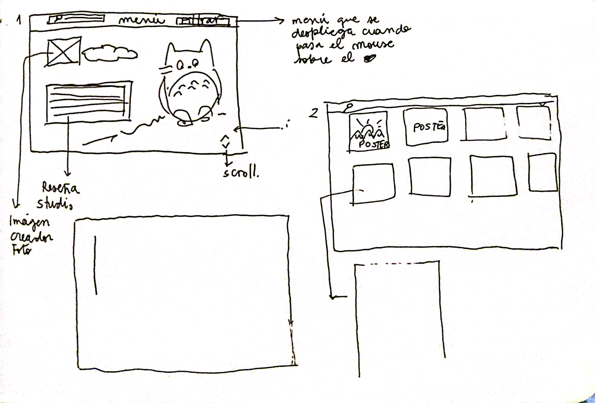
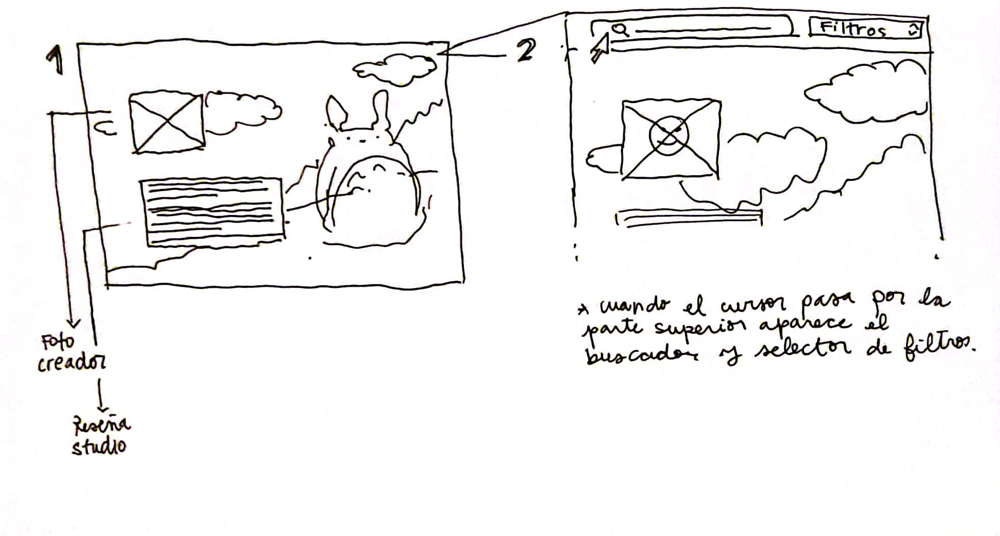
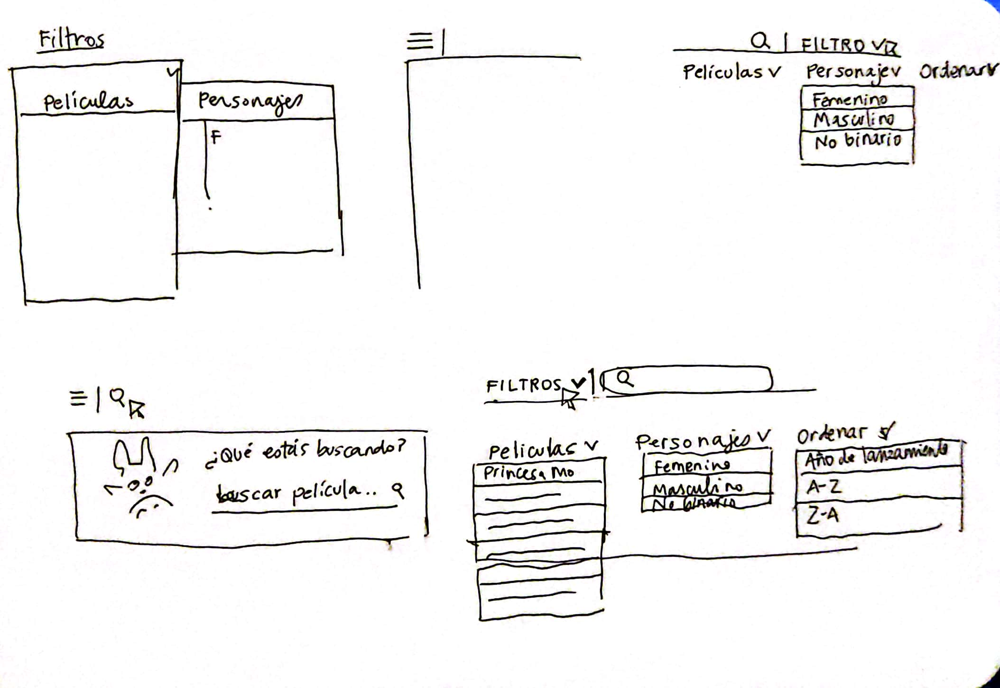
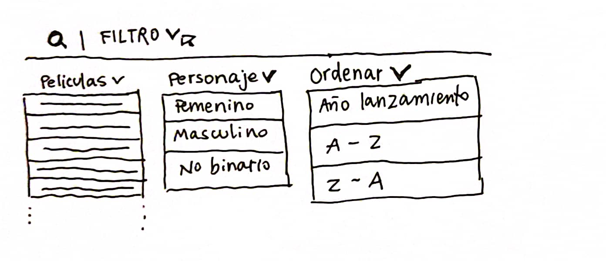
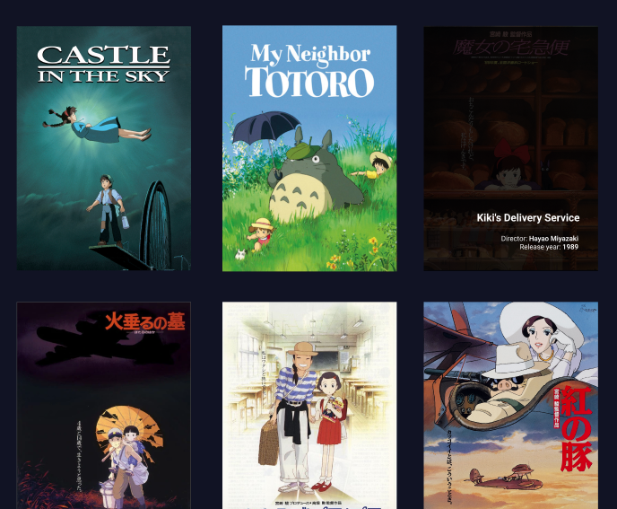
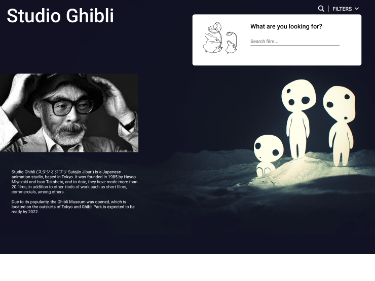
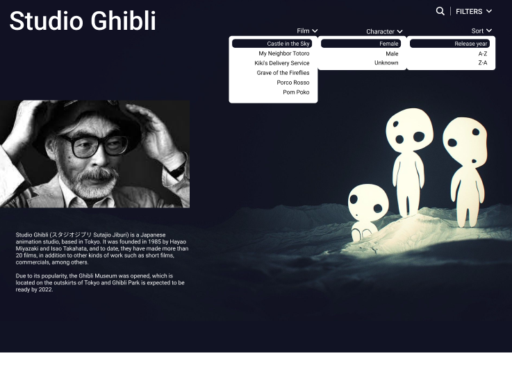
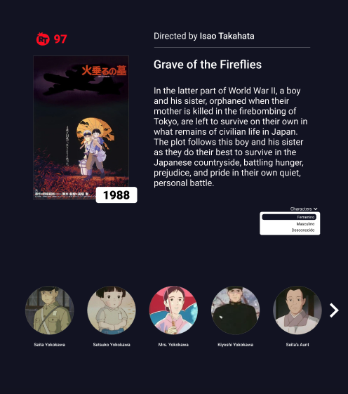

# Studio Ghibli

- Link proyecto: [Ir al sitio final](https://majesuso.github.io/SCL019-data-lovers//src/index.html)

Studio Ghibli es un estudio de animación japonés, conocido por sus largometrajes
animados como **Mi vecino Totoro**, **El viaje de Chihiro** o
**El castillo ambulante**, entre otros grandes éxitos.

Las animaciones tienen gran acogida a nivel mundial y algunas han recibido
varias nominaciones y premios. De todo este fandom hay un grupo que desea poder
interactuar y ver la información de las animaciones y sus personajes.

## Sobre la aplicación

Se desarrolló una plataforma llamada "Studio Ghibli", siendo una página web que permite a los seguidores de este estudio de animación ver todas las películas con sus respectivos nombres, poder filtrar por director, ordenar por abecedario y año de lanzamiento de manera ascendente y descendente.

Además, al seleccionar una película se podrá acceder a información más detallada de ella, como una sinopsis, año de lanzamiento, puntaje según Rotten Tomatoes, director y personajes.

### **Hallazgos**

Para desarrollar esta aplicación se busca entender mejor qué información podrían necesitar nuestras usuarias y así poder definir cómo ordenar y qué datos mostrar.
Para ello se hizo una rápida investigación y estos son algunos de los hallazgos:

- Studio Ghibli tiene varias animaciones, para nuestras usuarias es importante
  saber cuántas y cuáles son.
- Las animaciones tienen directorxs y productorxs. Estxs son las mentes detrás
  de una gran animación. En Studio Ghibli hay directorxs y productorxs que han
  colaborado en la creación de más de una animación. Por ello, es importante
  para nuestra usuaria poder conocerlos y saber cuántas y cuáles son las
  animaciones a las que dieron "vida".
- Las animaciones tienen información relevante para nuestras usuarias, como
  descripción, fecha de lanzamiento, puntaje, director, productor y personajes.
- Cada animación tiene sus personajes, para nuestras usuarias es importante
  saber cuántos y cuáles son
- Los personajes tienen características únicas que la usuaria quiere saber, como
  nombre, edad, género, especie, etc.
- Las animaciones tienen locaciones y vehículos únicos en cada una. Para
  nuestras usuarias es importante saber cuáles son.
- Adicionalmente a esta información, para nuestras usuarias es importante poder
  ver los tipos de especies que hay en cada animación.

### **Historias de Usuario**

A partir de los hallazgos se completaron las siguientes sentencias:

|Yo como|Quiero|Para lograrlo|
|--------|--------|--------|
|Seguidor principiante de Studio Ghibli|Saber información más detallada por cada pelicula, incluyendo a los personajes.|Ingresar a la página principal, hacer click en uno de los poster o seleccionar un título desde el selctor de películas, se mostrará una tarjeta de película con la información|
|Seguidor principiante de Studio Ghibli|Buscar películas por director|Ver selector Directors, elegir un nombre de director y ver las películas que aparecen|
|Seguidor principiante de Studio Ghibli|Ordenar por año de lanzamiento y ver desde la más reciente a la más antigua y viceversa|Ver selector Sort y elegir entre oldest o newest|

### **Prototipo de baja fidelidad**

### **Prototipo de alta fidelidad**

